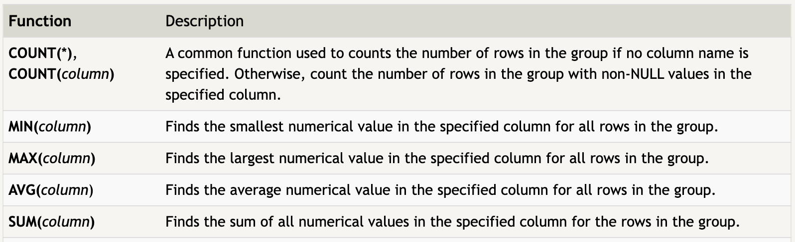

# Session – YYYY-MM-DD

## Topics covered
- Oracle's FreeSQL
- Aggregations

## What I understood
- Aggregate expressions (or functions) allow you to summarize information about a group of rows of data.
- Format: 
SELECT AGG_FUNC(column_or_expression) AS aggregate_description, …
FROM mytable
WHERE constraint_expression;
- Without a specified grouping, each aggregate function is going to run on the whole set of result rows and return a single value. And like normal expressions, giving your aggregate functions an alias ensures that the results will be easier to read and process.
- 

## What is still confusing
- Some small different usages for WHERE and HAVING

## Questions
- 

## Related concepts
- [Concept name](../concepts/concept-name.md)

## Resources used
- See `resources/`
